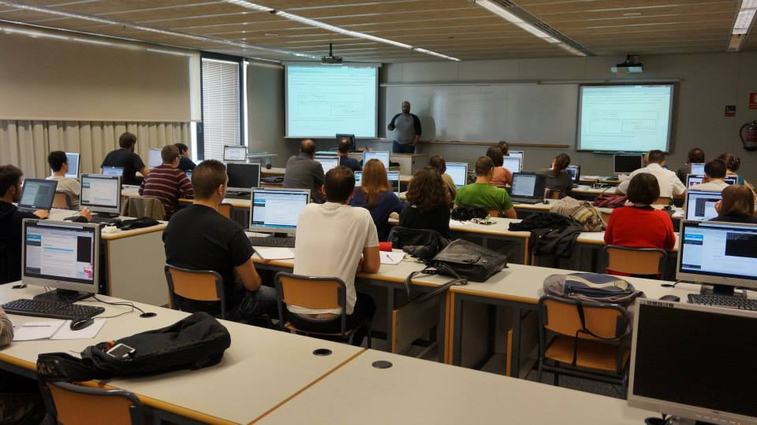
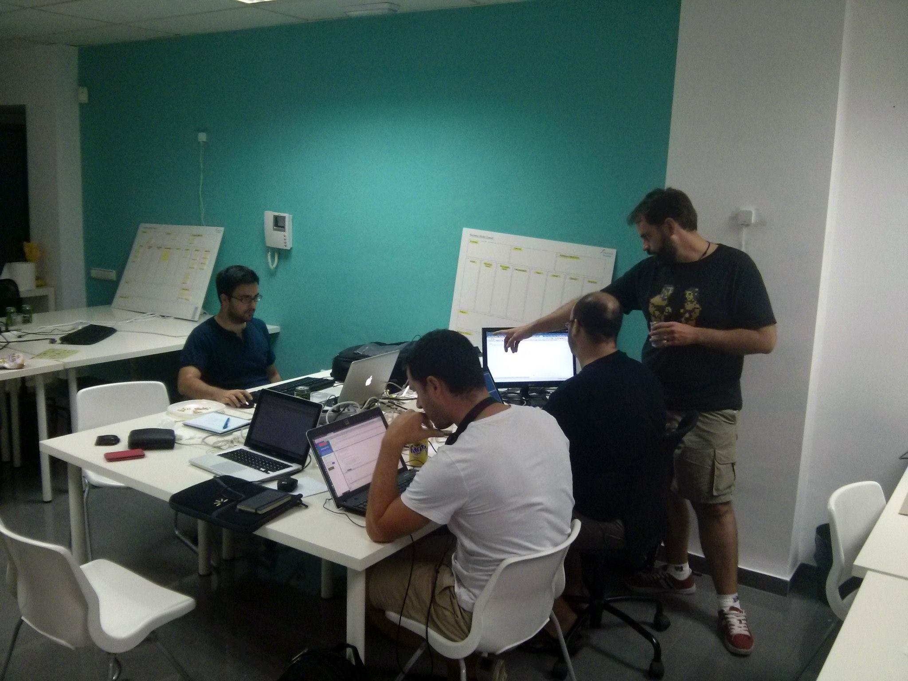
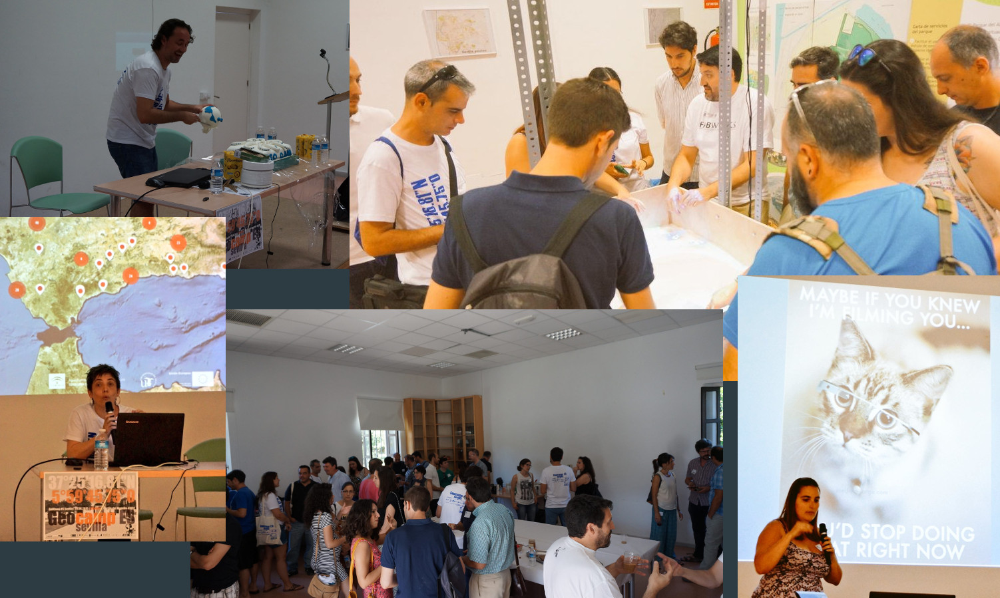
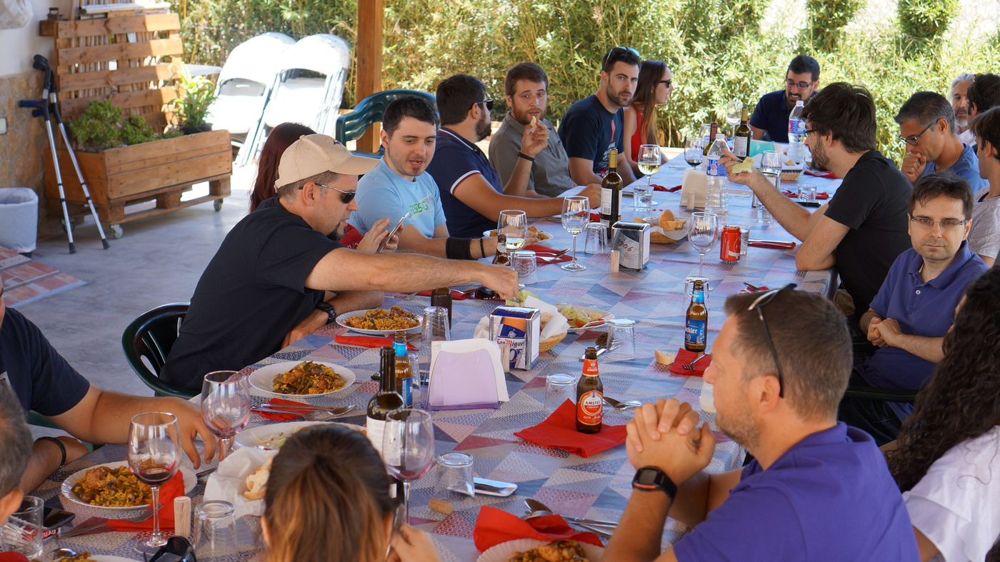

Geoinquietos Valencia<!-- .element style="font-size:2.5em;" -->
==========================

### y nuestra relación con el geovoluntariado

<!-- .element style="width:20%;" class="noborder"-->

* Jorge Sanz · [@xurxosanz](https://twitter.com/xurxosanz)
* Pedro-Juan Ferrer · [@vehrka](https://twitter.com/vehrka)
* UPV - 2016-11-30

---

## Quiénes somos

* Compañeros de promoción de IGC
* **Pasión** por la **colaboración**,  
  el software y los datos **libres**
* Junto con [Vicente Bayarri](https://twitter.com/geochente) montamos  
  [geomaticblog.net](https://geomaticblog.net/about/) en 2006
* Ese mismo año arranca [OSGeo.org](http://osgeo.org) (software)
* Poco después conocemos [OSM](http://osm.org) (datos)

---

## Geoinquietos

* FOSS4G 2010
* Aparece [Geoinquiets](http://geoinquietos.org/grupos/barcelona/)
* Otros grupos se suman

<!-- .element style="width:350px" -->

---

<iframe width="100%" height="520" frameborder="0" src="https://team.cartodb.com/u/jsanz/viz/bba0a17c-3ca7-11e6-8eeb-0ecfd53eb7d3/embed_map" allowfullscreen webkitallowfullscreen mozallowfullscreen oallowfullscreen msallowfullscreen></iframe>

---

## Geoinquietos Valencia

<!-- .element style="width:25%;float:right" class="noborder"-->

Arrancamos en 2011

* Nos comunicamos y coordinamos a través de
  * [Lista de correo](http://lists.osgeo.org/mailman/listinfo/valencia) ~80 inscritos
  * [@geoinquietosvlc](https://twitter.com/geoinquietosvlc) ~1200 seguidores
  * [Meetup](http://www.meetup.com/es-ES/Geoinquietos-Valencia) ~400 miembros
  * [telegram](https://telegram.me/geoinquietosvlc) ~20 miembros
  * [github](https://github.com/geoinquietosvlc)
  * [facebook](https://www.facebook.com/geoinquietosVLC) ~470 seguidores
* Más información en [el wiki](http://valencia.geoinquietos.org)

---

## Actividades

---

## Charlas

<!-- .element class="icon noborder"-->

<!-- .element style="max-width:70%"-->

---

## Talleres y cursos

<!-- .element class="icon noborder"-->

<!-- .element style="max-width:70%"-->

---

## Hackatones

<!-- .element class="icon noborder"-->

<!-- .element style="max-width:70%"-->

---

## Mapping parties

<!-- .element class="icon noborder"-->

<!-- .element style="max-width:70%"-->

---

## Mapatones

<!-- .element class="icon noborder"-->

<!-- .element style="max-width:70%"-->

---

## Geocamp

<!-- .element class="icon noborder"-->

<!-- .element style="max-width:70%" class="noborder"-->

---

## Geobirras

<!-- .element class="icon noborder"-->

<!-- .element style="max-width:70%"-->

---

## Geopaella

<!-- .element class="icon noborder"-->

<!-- .element style="max-width:70%"-->

---

## Geovoluntariado

* Participación en **activaciones** del HOT
  * Tifón Yolanda (Filipinas) **~70** participantes
  * Terremoto de Nepal **~30** participantes
  * Huracán Matthew **~25** participantes
* Geovoluntariado UPV
  * Coordinación
  * Logística
  * Apoyo institucional (UPV, empresas?)

---

¿Preguntas?<!-- .element style="font-size:2.5em;" -->
==========================

<!-- .element style="width:20%;" class="noborder"-->

* Jorge Sanz · [@xurxosanz](https://twitter.com/xurxosanz)
* Pedro-Juan Ferrer · [@vehrka](https://twitter.com/vehrka)
* UPV - 2016-11-30

